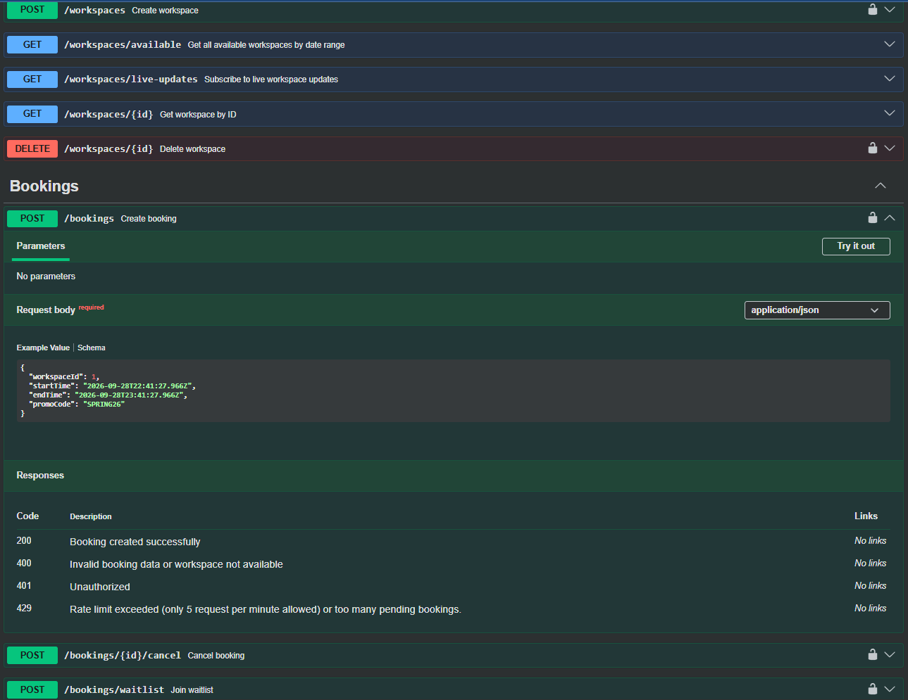

# Flexispace API

[](https://github.com/danil2205/flexispace-api/actions/workflows/ci.yml)
[](https://github.com/danil2205/flexispace-api)
[](https://nodejs.org/)
[](https://nestjs.com/)
[](LICENSE)

---

## Overview

Flexispace API is a backend service built to power modern on-demand workspace, meeting room, and desk reservation platforms with real-time availability management. It provides a transactional booking lifecycle, secure Stripe checkout flows, event-driven WebSocket updates, and background job processing to deliver a fast, reliable coworking management experience.

---

## Tech Stack

- **Framework & Core:** [NestJS](https://nestjs.com/) (v11), [TypeScript](https://www.typescriptlang.org/) (v5), [Node.js](https://nodejs.org/) (v22), Express, SWC
- **Database & ORM:** [PostgreSQL](https://www.postgresql.org/) (v17 Alpine), [TypeORM](https://typeorm.io/) (with automated migrations, relation mapping, and pessimistic locking)
- **Caching & Background Queues:** [Redis](https://redis.io/) (Alpine), [BullMQ](https://docs.bullmq.io/) (job queue orchestration for email delivery and waitlists), `@nestjs/cache-manager`
- **Integrations & Third-Party:**
  - **Payments:** [Stripe](https://stripe.com/) (Checkout sessions, idempotency, webhook signature verification)
  - **Object Storage:** [AWS S3](https://aws.amazon.com/s3/) / [MinIO](https://min.io/) (S3-compatible bucket for workspace images and media)
  - **Mailing & Calendar:** [Nodemailer](https://nodemailer.com/), [Mailtrap](https://mailtrap.io/), EJS templates, and [ical-generator](https://github.com/sebbo2002/ical-generator) (.ics calendar attachments)
  - **Identity:** Google OAuth 2.0 (`passport-google-oauth2`)
- **Security & Reliability:** JWT (Access & Refresh tokens with rotation), Two-Factor Authentication (TOTP via `otplib` & QR codes), [Helmet](https://helmetjs.github.io/), rate limiting (`@nestjs/throttler`), role-based access control (RBAC), and anti-fraud booking limits
- **Infrastructure & CI/CD:** [Docker](https://www.docker.com/), Docker Compose, [GitHub Actions](https://github.com/features/actions)

---

## Key Features

- **Concurrency-Safe Booking Engine:** Employs database transactions with `READ COMMITTED` isolation and pessimistic write locking (`pessimistic_write`) to prevent double-booking and race conditions during high-concurrency reservation spikes.
- **Smart Refund & Cancellation Policies:** Automated cancellation handling with tiered refund thresholds (full refund eligible vs. minimum cancellation cutoff) and instantaneous status propagation.
- **Automated Waitlist Queue:** Enables users to queue for fully occupied workspaces; when a reservation is cancelled, waitlisted users are asynchronously alerted via queued background jobs.
- **Stripe Checkout & Webhook Handling:** Handles end-to-end payment lifecycles with raw payload signature validation, ensuring secure and idempotent booking state transitions on `checkout.session.completed`.
- **Real-Time WebSocket Notifications:** Employs Socket.io gateways with room isolation (`booking_<id>`) to broadcast live booking confirmation events immediately upon payment completion.
- **Asynchronous Mail & Calendar Sync:** Leverages BullMQ worker queues to render and dispatch branded EJS confirmation receipts bundled with standard `.ics` calendar files.
- **Workspace Discovery & Real-Time Availability:** Flexible workspace filtering (price range, capacity, workspace types) combined with Server-Sent Events (SSE) for instant catalog updates.
- **Dynamic Promo Codes Engine:** Supports percentage-based and fixed-amount discounts with usage quotas, expiration controls, and minimum order spend thresholds.
- **Enterprise-Grade Authentication & Security:** Dual-token JWT architecture with refresh token rotation, Google OAuth 2.0 social sign-in, optional TOTP 2FA, anti-fraud booking throttlers, and custom role guards.
- **High-Coverage Testing Suite:** Thoroughly covered by unit tests and an extensive suite of isolated E2E tests validating controllers, gateways, webhooks, and exception filters.

---

## API Documentation

The API is fully documented using OpenAPI 3.0 via Swagger. It includes interactive request schemas, response codes, and built-in Bearer JWT authentication support.

Once the application is running locally, access the interactive documentation at:

```
http://localhost:3000/api
```

<p align="center">
  
</p>

---

## Local Development

Follow the instructions below to get a local development instance running.

### 1. Prerequisites

- **Node.js**: `v22.x` or higher
- **npm**: `v10.x` or higher
- **Docker & Docker Compose** (for running PostgreSQL, Redis, and MinIO)

### 2. Clone the Repository

```bash
git clone https://github.com/danil2205/flexispace-api.git
cd flexispace-api
```

### 3. Install Dependencies

```bash
npm install
```

### 4. Configure Environment Variables

Create your local development environment configuration file from `.env.example`:

```bash
# On Linux/macOS
cp .env.example .env.development

# On Windows (PowerShell)
Copy-Item .env.example .env.development
```

> **Note:** The development server (`npm run start:dev`) and Docker Compose read `.env.development`. Adjust the database, Redis, Stripe, and Mailtrap credentials in this file to match your setup.

### 5. Start with Docker Compose

Start the full stack (API, PostgreSQL, Redis, and MinIO):

```bash
docker compose up -d
```

### 6. Run Database Migrations & Seed Data

> **Note:** With `DB_MIGRATIONS_RUN=true` (the default in `.env.development`), migrations execute **automatically** on application startup. You only need to run this command if you want to execute migrations manually before starting the app:

```bash
npm run migration:run
```

### 7. Run the Application

```bash
# Development mode with hot reload
npm run start:dev

# Production build and run
npm run build
npm run start:prod
```

The server will be available at `http://localhost:3000`. You can verify its status via the health check endpoint: `http://localhost:3000/health`.

---

## Testing

The project maintains high code reliability through Jest unit tests and comprehensive End-to-End (E2E) suites.

### Unit Tests

Run isolated unit tests for services, controllers, and processors:

```bash
# Run all unit tests
npm run test

# Run tests in watch mode
npm run test:watch

# Generate unit test coverage report
npm run test:cov
```

### End-to-End (E2E) Tests

E2E tests spin up an in-memory or test database instance with Redis to validate real HTTP endpoints, webhooks, guards, and Socket.io gateways:

```bash
# Run all E2E test suites
npm run test:e2e

# Run E2E tests with coverage report
npm run test:e2e:cov
```

### Code Quality & Formatting

```bash
# Run ESLint with auto-fix
npm run lint

# Format code with Prettier
npm run format
```
